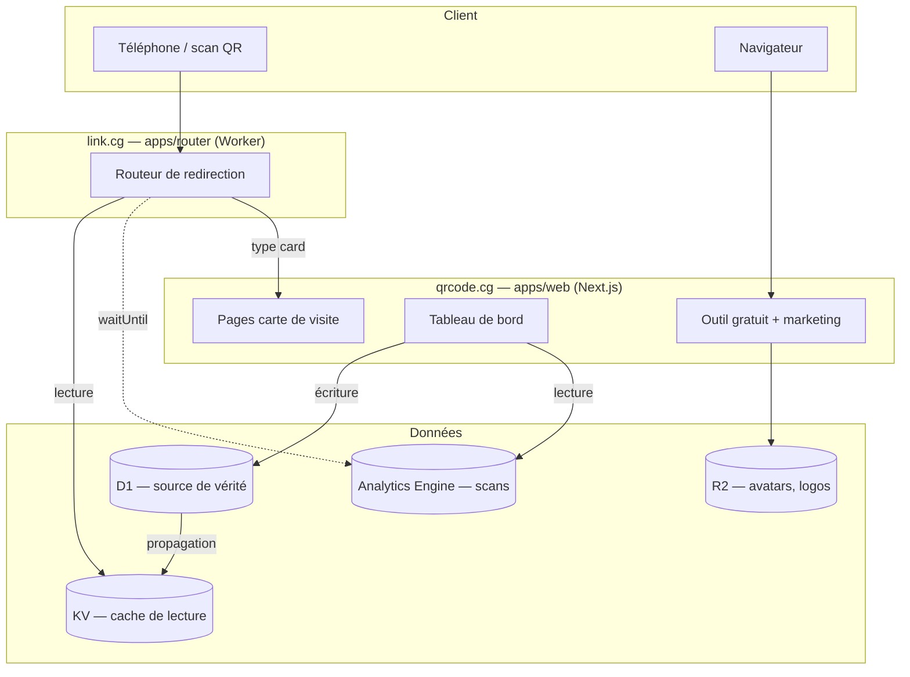

# Architecture technique

Plateforme de liens intelligents : lien court, routage app store, carte de visite
numérique, QR dynamique. Deux domaines, un seul système.

- **`qrcode.cg`** — acquisition. Site marketing, outil QR gratuit, tableau de bord.
- **`link.cg`** — infrastructure. Toutes les redirections des clients.

---

## 1. Le principe fondateur

Les quatre « produits » ne sont pas quatre systèmes. Ce sont quatre présentations
d'un seul objet :

```
Link { slug, domaine, règle de routage }
```

| Produit             | Règle de routage                                          |
| ------------------- | --------------------------------------------------------- |
| Lien court          | `{ type: 'static', url }`                                  |
| Lien d'app          | `{ type: 'app', ios, android, fallback }`                  |
| Carte de visite     | `{ type: 'card', profileId }`                              |
| QR dynamique        | *aucune* — un QR est une **image** qui pointe vers un Link |

Le QR dynamique n'est pas une fonctionnalité du routeur : c'est un design de QR
attaché à un Link existant. Construire le raccourcisseur donne le QR dynamique
gratuitement.

---

## 2. Vue d'ensemble



---

## 3. Le chemin critique : la redirection

C'est la seule partie du système où la performance est un enjeu produit. Un QR
imprimé est scanné en 4G depuis un restaurant ; si la redirection prend 800 ms,
le produit est perçu comme cassé.

### Trois règles non négociables

**1. La lecture ne touche jamais D1.**
D1 a une région primaire ; une lecture depuis Brazzaville vers un primaire
européen coûte des centaines de millisecondes. KV est répliqué en périphérie.

> **D1 est la source de vérité, KV est une vue matérialisée en lecture.**
> Toute écriture va dans D1 puis propage vers KV. Jamais l'inverse.

**2. L'analytique ne bloque jamais la redirection.**
La réponse 302 part d'abord, l'enregistrement du scan se fait dans
`ctx.waitUntil()`. Si Analytics Engine tombe, les liens continuent de marcher.

**3. Toujours 302, jamais 301.**
Un 301 est mis en cache par le navigateur de façon quasi permanente. Un client
qui change la destination de son lien verrait les anciens scans continuer vers
l'ancienne URL — ce qui détruit toute la proposition de valeur du dynamique.

```
302 Found
Cache-Control: no-store, no-cache, must-revalidate
```

### Flux

```
GET link.cg/a1b2
  │
  ├─ 1. extraire slug + hostname
  ├─ 2. KV.get(`${hostname}:${slug}`)      ~5-10 ms
  │      └─ absent → page 404 de marque
  ├─ 3. évaluer la règle
  │      ├─ inactif / expiré  → page dédiée
  │      ├─ static            → url
  │      ├─ app               → sniff User-Agent → ios | android | fallback
  │      └─ card              → qrcode.cg/c/{slug}
  ├─ 4. return 302                          ← la réponse part ici
  └─ 5. ctx.waitUntil(logScan())            ← après la réponse
```

### Le routage app store

Une centaine de lignes, et c'est le produit le plus différenciant.

```ts
function resolveApp(ua: string, rule: AppRule): string {
  if (/iPhone|iPad|iPod/i.test(ua)) return rule.ios ?? rule.fallback
  if (/Android/i.test(ua))          return rule.android ?? rule.fallback
  return rule.fallback
}
```

Attention aux navigateurs in-app (Instagram, Facebook, TikTok) : leurs WebViews
gèrent mal les redirections vers les stores. Prévoir une page intermédiaire avec
lien manuel pour ces User-Agents.

---

## 4. Modèle de données

D1 (SQLite). Schéma géré avec Drizzle, migrations versionnées dans `packages/db`.

```sql
workspaces      id, name, plan, created_at
users           id, email, name, created_at
memberships     user_id, workspace_id, role            -- owner | admin | member

domains         id, workspace_id, hostname, verified, is_default
                -- 'link.cg' partagé, ou 'go.client.cg' via Cloudflare for SaaS

links           id, workspace_id, domain_id, slug,
                kind,          -- static | app | card
                rule,          -- JSON, union discriminée
                active, expires_at,
                created_at, updated_at
                UNIQUE (domain_id, slug)

qr_designs      id, link_id, config    -- JSON : couleurs, formes, logo
card_profiles   id, link_id, full_name, title, org, phone, email,
                socials, avatar_key, theme

link_reviews    link_id, status, checked_at, provider  -- anti-abus
```

Les **scans ne vont pas dans D1**. Volume trop élevé, cardinalité trop forte,
coût d'écriture prohibitif. Ils vont dans **Analytics Engine**, conçu pour ça et
interrogeable en SQL depuis le tableau de bord.

```ts
env.SCANS.writeDataPoint({
  blobs:   [linkId, country, deviceType, referrer],
  doubles: [1],
  indexes: [workspaceId],
})
```

### Propagation D1 → KV

À chaque création ou modification d'un lien, écrire la règle compilée dans KV :

```ts
await db.update(links)...           // 1. vérité
await env.LINKS.put(               // 2. vue de lecture
  `${hostname}:${slug}`,
  JSON.stringify(compiledRule),
)
```

Si l'écriture KV échoue, la retenter via une Queue. Une divergence KV/D1 est le
bug le plus probable du système — prévoir une commande de resynchronisation
complète dès le départ.

---

## 5. Structure du monorepo

```
link-platform/
├─ apps/
│  ├─ web/          Next.js 16 — qrcode.cg (Pages)
│  │                marketing, outil gratuit, dashboard, pages /c/{slug}
│  ├─ router/       Worker — link.cg : redirection seule, KV uniquement
│  └─ api/          Worker — écriture des liens : D1 + KV
├─ packages/
│  ├─ qr/           sérialiseurs de contenu + config QR (pur, sans DOM)
│  ├─ ui/           composants partagés (Card, OptionBtn, HexInput…) — à venir
│  ├─ db/           schéma Drizzle, migrations, createLink (D1→KV)
│  └─ shared/       types, schémas Zod, règles de routage + resolveLink
├─ docs/
├─ pnpm-workspace.yaml
└─ turbo.json
```

**Note d'implémentation (2026-07-21).** Le plan initial mettait l'API dans
`apps/web`. En pratique, `apps/web` est déployé sur **Cloudflare Pages**, où
brancher les bindings D1/KV imposerait de migrer vers l'adaptateur OpenNext dès
maintenant. L'API a donc été isolée dans un Worker **`apps/api`** (bindings D1/KV
natifs, même modèle que le routeur). Décision réversible : quand `apps/web`
passera à un adaptateur Cloudflare avec bindings, l'API pourra s'y replier sous un
route group. Le cœur métier vit de toute façon dans `@link/db`, pas dans le Worker.

**`apps/router` est isolé dès le premier jour**, parce que ses contraintes n'ont
rien à voir avec celles du reste : latence critique, déploiement indépendant,
surface de code minimale. Il ne doit dépendre que de `packages/shared`.

### `packages/qr` — l'extraction la plus rentable

Les sérialiseurs actuels de `ContentCard.tsx` (`buildText`, lignes 180-215) sont
des **fonctions pures** noyées dans un composant React. Les sortir en premier :

```ts
// packages/qr/src/serializers.ts
export const toWifi  = (i: WifiInput)  => `WIFI:T:${i.security};S:${esc(i.ssid)};…`
export const toVCard = (i: VCardInput) => [...].join('\n')
export const toGeo   = (i: GeoInput)   => `geo:${i.lat},${i.lng}${q}`
```

Bénéfice immédiat : testables sans React, réutilisables côté Worker pour la
génération serveur et l'export en lot.

### Génération du QR : client ou serveur ?

`qr-code-styling` dépend du DOM (canvas/SVG navigateur) — il ne tourne pas tel
quel dans un Worker.

| Contexte                      | Où           | Pourquoi                                    |
| ----------------------------- | ------------ | ------------------------------------------- |
| Outil gratuit `qrcode.cg`     | **Client**   | coût nul, tient la promesse « rien stocké » |
| Export en lot / API / e-mail  | **Serveur**  | pas de navigateur dans la boucle            |

Garder `packages/qr` **agnostique du rendu** : il produit la *chaîne* et la
*config*, le moteur de rendu est injecté. Côté serveur, générer du SVG pur (sans
DOM) et rasteriser via Resvg si un PNG est nécessaire.

---

## 6. Domaines et déploiement

| Hôte                    | Cible                | Mécanisme                       |
| ----------------------- | -------------------- | ------------------------------- |
| `qrcode.cg`             | `apps/web`           | Workers via OpenNext            |
| `link.cg/*`             | `apps/router`        | Worker, route sur le domaine    |
| `go.client.cg`          | `apps/router`        | Cloudflare for SaaS (SSL/SaaS)  |

Les domaines personnalisés passent par **Cloudflare for SaaS** : le client
pointe un CNAME vers l'origine, Cloudflare émet le certificat. Le routeur résout
le lien par `(hostname, slug)` — d'où la clé composite dans KV et l'unicité sur
`(domain_id, slug)`.

C'est à la fois une offre payante et un **pare-feu de réputation** : un client
sur son propre domaine ne dépend plus de la réputation de `link.cg`.

Mise en œuvre, étapes manuelles d'activation et limites : voir
[`DOMAINES.md`](./DOMAINES.md).

---

## 7. Anti-abus — la partie qui protège l'actif

Le risque réel n'est pas technique, il est existentiel : si `link.cg` est
blacklisté par Google Safe Browsing, **tous les liens de tous les clients meurent
simultanément**, y compris ceux déjà imprimés sur des cartes de visite.

**Compte obligatoire pour créer un lien.** Aucun raccourcissement anonyme. Cette
seule mesure élimine l'essentiel de l'abus automatisé.

**Vérification à la création *et* à la modification.** Le mode opératoire
classique consiste à faire valider un lien propre, puis à changer la destination
vers du phishing une fois la confiance acquise. Toute écriture sur `rule` doit
repasser par la vérification.

**Re-vérification périodique.** Une destination légitime peut être compromise
plus tard. Un Cron Trigger qui repasse sur les liens actifs, par lots.

**Limitation de débit par workspace**, avec un plafond bas sur le plan gratuit.

**Étanchéité des domaines.** `qrcode.cg` et son SEO ne doivent jamais dépendre de
`link.cg`. Si l'un tombe, l'autre survit.

---

## 8. Choix techniques

| Besoin        | Choix                    | Raison                                        |
| ------------- | ------------------------ | --------------------------------------------- |
| Orchestration | Turborepo                | cache des tâches, sur pnpm workspaces          |
| Lecture liens | Workers KV               | réplication périphérique, lecture ~5-10 ms     |
| Vérité        | D1 + Drizzle             | SQL, migrations, typage bout en bout           |
| Scans         | Analytics Engine         | écritures massives, requêtable en SQL          |
| Fichiers      | R2                       | pas de frais de sortie                         |
| Asynchrone    | Queues + Cron Triggers   | resync KV, re-scan anti-abus                   |
| Auth          | Better Auth (D1)         | compatible Workers, pas de vendor lock         |
| Paiement      | Mobile money + Stripe    | voir volet commercial                          |

Sur l'auth : **Better Auth** avec adaptateur D1 garde tout dans le système et
évite un coût par utilisateur actif. **Clerk** est l'option « payer pour aller
vite » si le temps prime sur la marge — décision réversible tant que la table
`users` reste la référence interne.

---

## 9. Chemin de migration depuis le dépôt actuel

L'existant est sain : Next 16, React 19, Tailwind v4, ~1 460 lignes, typecheck
propre. Il devient `apps/web` sans réécriture.

1. **Supprimer `package-lock.json`** (non suivi). Un lockfile npm dans un
   workspace pnpm casse activement la résolution.
2. `git mv` de la racine vers `apps/web/`.
3. Ajouter la clé `packages:` à `pnpm-workspace.yaml` — elle n'existe pas encore,
   le fichier ne contient aujourd'hui que `ignoredBuiltDependencies`.
4. Extraire `packages/qr` (sérialiseurs de `ContentCard`, `config.ts`,
   `translations.ts`) puis `packages/ui` (`atoms.tsx`).
5. Créer `apps/router` — Worker vide, redirection statique, déployé sur `link.cg`.
   Le valider de bout en bout avant d'ajouter la moindre règle.
6. `packages/db` : schéma, migrations, propagation vers KV.
7. Brancher le dashboard sur `apps/web`, route group `(app)`.

Ordre délibéré : le routeur en production avec une seule règle statique **avant**
toute interface. C'est le composant dont tout dépend et le seul qu'on ne peut pas
corriger après impression.

### Dette connue à traiter au passage

- `atoms.tsx:48` — erreur ESLint `react-hooks/set-state-in-effect` sur
  `HexInput`. À corriger avec le pattern « ajuster l'état pendant le rendu ».
- `README.md` — encore celui de `create-next-app`.
- Aucun test. `packages/qr` est le premier candidat évident : fonctions pures,
  sorties normalisées (vCard, `WIFI:`, `geo:`) où une régression casse
  silencieusement des QR déjà imprimés.
